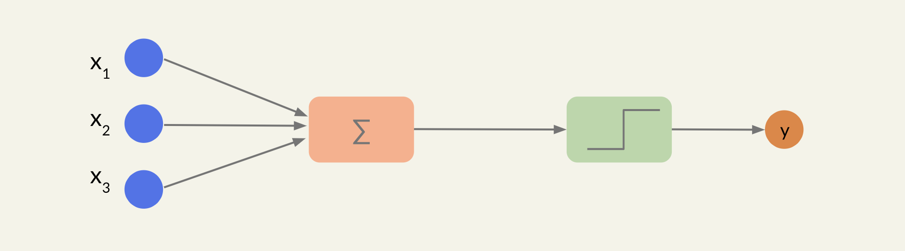
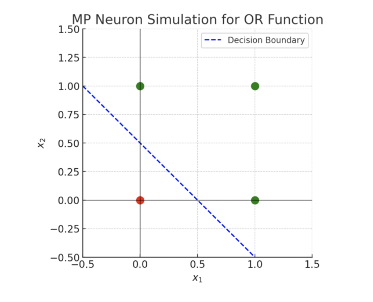
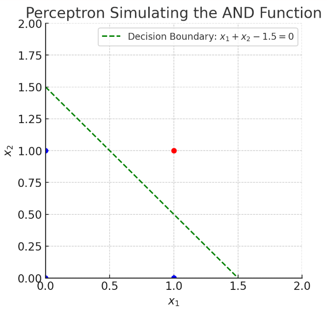

---
title: "History of Perceptron"
date: 2023-11-21
draft: false
---

We will embark on a historical exploration of the perceptron, a foundational model in the field of artificial intelligence that has given rise to the deep learning technologies transforming our world. The perceptron, introduced by Frank Rosenblatt in 1958, is the conceptual forerunner of contemporary machine learning architectures such as CNNs, DNNs, and the Transformer models driving the current AI boom. As we trace the evolution from original model to the sophisticated algorithms of today, we will examine the pivotal developments, both technical and theoretical, that have contributed to the advancement of AI. 

## Introduction

This journey through the annals of machine learning will not only highlight the technological milestones but also illuminate the resilience of scientific inquiry in the face of challenges—a narrative that underscores the perceptron's enduring legacy and its impact on modern computational intelligence.

### Primarily works



*From left to right: a diagram proposing how the eyes could relay a cohesive view of reality to the brain, a Purkinje neuron from the human cerebellum, and a diagram depicting the information flow through the hippocampus.* [8]

The idea of the artificial neuron has its roots in the pioneering neuroscience work, specifically the anatomical studies of Santiago Ramon y Cajal and the physiological insights of Sir Charles Scott Sherrington, who demonstrated the discrete and interconnected nature of neurons.

> The neuron doctrine, proposed by Santiago Ramon y Cajal, states that neurons are the basic functional units of the nervous system, existing as individual cells that communicate with each other through synapses. This concept challenged the previously held view that the nervous system was made up of a continuous network, reshaping our understanding of neural structure and function.

Building on the biological insights into how neurons communicate and contribute to behavior, Warren McCulloch and Walter Pitts introduced a simplified mathematical model of the neuron in 1943.

  

*A schematic of a biological neuron with dendrites: receives signals from other neurons. Soma: processes information. Axon: sends out the neuron's output. Synapse: connects with other neurons. Essentially, a neuron in our brain takes an input, processes it, and generates an output.*

### McCulloch-Pitts Neuron

Their model used binary inputs and outputs to mimic the all-or-nothing firing of biological neurons, laying the foundational theory for artificial neural networks. Their work bridged the gap between biological processes and computational functions, suggesting that networks of these binary neurons could perform complex tasks similar to the human brain, a principle that would eventually be crucial to the development of modern AI and neural networks.

In this model, a neuron can have multiple binary inputs (usually denoted as $ x_1, x_2, \ldots, x_n$) which are either $0$ (off) or $1$ (on). Each input is associated with a weight (for the M-P neuron, these are often considered to be of unit value). The neuron processes these inputs by summing them up, and if the sum is above a certain threshold, $\theta$, the neuron outputs a $1$; otherwise, it outputs a $0$.

The behavior of an M-P neuron can be described by the following equation:

$$
y = 
\begin{cases} 
1 & \text{if } \sum_{i=1}^{n} x_i \geq \theta \\\
0 & \text{otherwise} 
\end{cases}
$$

where:

- $y$ is the output of the neuron,
- $x_i$ are the input signals,
- $\theta$ is the threshold.

Here, the step function serves as the activation function:

$$
g(x) = \begin{cases}
1& \text{if } x > 0 \\\\
0& \text{if } x ≤ 0
\end{cases}
$$



#### Example: OR Function

For an OR function, which outputs 1 if any of its inputs are 1, we can set the threshold $\theta$ to $1$. This means that if any of the inputs are 1 (or more), the neuron will fire.

$$
y = 
\begin{cases} 
1 & \text{if } x_1 + x_2 \geq 1 \\\
0 & \text{otherwise} 
\end{cases}
$$

Suppose we have two inputs $x_1$ and  $x_2$.The neuron will output a 1 if $x_1$ OR $x_2$ is 1, just like the logical OR operation. Graphically, 

*We can have 4 inputs: $(0,0), (0,1), (1,0),(1,1)$*. the decision boundary $x_1​+x_2​=1$ separates the inputs into two groups: those above the line output 1 and those below output 0.

#### Example: AND Function

For an AND function, which outputs 1 only if all of its inputs are 1, we set the threshold $\theta$ to the number of inputs, which is 2 in the case of two inputs. The neuron would then only output a 1 if both $x_1$ AND $x_2$ are 1.

$$
y = 
\begin{cases} 
1 & \text{if } x_1 + x_2 \geq 2 \\\
0 & \text{otherwise} 
\end{cases}
$$

This illustrates how the M-P neuron model can be used to simulate basic logical operations. 

## Rosenblatt's Perceptron

Frank Rosenblatt's perceptron was an early artificial neural network model that married the concept of Hebbian learning with the McCulloch-Pitts neuron. Hebb's idea that the efficiency of synapses increases with frequent activation inspired the perceptron's weight adjustment mechanism, allowing it to learn from data. Meanwhile, it retained the binary threshold function of the McCulloch-Pitts neuron, where it would 'fire' if inputs exceeded a certain threshold. 

Rosenblatt's key contribution was in devising a way for these artificial neurons to automatically refine their connections (weights) based on the accuracy of their output, thus imbuing the system with the capacity for learning.

> The perceptron was conceptualized as an algorithmic simulation of a biological neuron's process. It was devised to have adjustable weights that are optimized through a learning process, enabling it to perform binary classifications. The weights are tweaked based on the differences between the predicted and actual results, a rudimentary form of what we now call the learning algorithm.



*Rosenblatt implementation of the perceptron: Mark 1 Perceptron.*



The perceptron takes binary or real-valued inputs ($ x_1, x_2, \ldots, x_n $), multiplies them with corresponding weights ($ w_1, w_2, \ldots, w_n $), and then sums these weighted inputs. This sum is then passed through an activation function, which in the simplest form is a step function similar to the M-P neuron:

$$
y = 
\begin{cases} 
1 & \text{if } \sum_{i=1}^{n} w_i x_i \geq \theta \\\
0 & \text{otherwise}
\end{cases}
$$

However, unlike the M-P neuron, if the perceptron makes a mistake (the output $y$ does not match the expected output), the weights are adjusted according to the rule:

$$
w_i \leftarrow w_i + \Delta w_i
$$

where $\Delta w_i$ is calculated based on the learning rate and the difference between the expected and actual output ($η⋅\epsilon$).

> Rosenblatt investigated schemes whereby the magnitudes of the weights would be altered under (supervised) training. Rosenblatt did not develop a formula for describing the training of any other than single layer neural networks (in modern terminology). The famous backpropagation formula had yet to be developed. [6]

**Perceptron Learning Rule (Simplified)**

Given inputs $x_1, x_2, ..., x_n$, weights $w_1, w_2, ..., w_n$, and a learning rate $\alpha$, the perceptron rule updates the weights:

1. Initialize weights to 0 or small random values.
2. For each training sample:
   a. Compute the output value $\hat{y}$, using the step function for activation.
   b. Update the weights based on the error $(y - \hat{y})$, where $y$ is the true label.

$$
w_i^{(new)} = w_i^{(old)} + \alpha (y - \hat{y}) x_i
$$

3. Repeat step 2 until the algorithm converges (i.e., the error is minimized or over a fixed number of iterations).

### Example: AND function [3]

Consider the following perceptron where the activation function is the
step function ($g(x) = 1$ if $x > 0$, $g(x) = 0$ if $x ≤ 0$). What should the weights $b, w_1,w_2$ be such that the perceptron represents an AND function? 

The idea is to draw it in the $x_1, x_2$ plane and find a linear separator between them. Any line going through this gap would work, but we’ll pick this line with $x_1$ and $x_2$ intercepts of 1.5 and a slope of −1.  

Our line is $x_2 = −x_1 + 1.5$, which we can rewrite as $x_1 + x_2 − 1.5 = 0$.

Our (1, 1) input should be positive when we substitute it into the left-hand side of the inequality. We see that $1 + 1 − 1.5 = 0.5 > 0$, so the
inequality we need is $x_1 + x_2 − 1.5 > 0$. Finally, we read the weights off of the coefficients: $b = −1.5, w_1 = 1, w_2 = 1$.

## The Perceptron's Limitations and AI Winter

Despite initial enthusiasm, the perceptron's limitations became apparent, notably its inability to process the XOR function, as famously highlighted by Marvin Minsky and Seymour Papert in their 1969 book "Perceptrons." This undermined confidence in neural networks, contributing to the first "AI Winter"—a period of reduced funding and interest in AI research.

**XOR Limitation**

The XOR function outputs true only when the input variables differ (one is true, the other is false). The XOR (exclusive OR) truth table for two binary inputs is as follows:

$$
\begin{array}{cc|c}
x_1 & x_2 & \text{XOR}(x_1,x_2) \\\
\hline
0 & 0 & 0 \\\
0 & 1 & 1 \\\
1 & 0 & 1 \\\
1 & 1 & 0 \\\
\end{array}
$$

In this table, $x_1$ and $x_2$ represent the two inputs, and the XOR column represents the output. The output is 1 if and only if $x_1$is not equal to $x_2$.



*Graphically, if you plot the XOR function for two variables, there is no single straight line that can separate the points (0,1) and (1,0) from (0,0) and (1,1), because the first two should output 1 and the latter two should output 0.*

![Image taken from [3]](resources/percepron_xor.png) 

In the context of the perceptron, this means that it cannot correctly classify the outputs of the XOR function, because it relies on finding a linear boundary to separate the classes.

Let's prove it! [[3]](https://www.cs.toronto.edu/~axgao/cs486686_f21/lecture_notes/Lecture_08_on_Neural_Networks_1.pdf)

The XOR function is defined as follows for binary inputs $x_1$ and $x_2$:

$$
\text{XOR}(x_1, x_2) = 
\begin{cases} 
1 & \text{if } (x_1 = 1 \text{ AND } x_2 = 0) \text{ OR } (x_1 = 0 \text{ AND } x_2 = 1) \\\
0 & \text{otherwise}
\end{cases}
$$

This gives us the following truth table:

$$
\begin{array}{cc|c}
x_1 & x_2 & \text{XOR}(x_1, x_2) \\\
\hline
0 & 0 & 0 \\\
0 & 1 & 1 \\\
1 & 0 & 1 \\\
1 & 1 & 0 \\\
\end{array}
$$

Graphically,

- Points (0,1) and (1,0) will be classified as 1.
- Points (0,0) and (1,1) will be classified as 0.

If you try to draw a single straight line (which represents the decision boundary of a perceptron) to separate the points with output 1 from those with output 0, you'll find that it's not possible. In a perceptron, the decision boundary is determined by the weights and bias, and it can be represented by the equation $w_1x_1 + w_2x_2 + b = 0$.

The perceptron's output function for any input is:

$$
y = 
\begin{cases} 
1 & \text{if } w_1x_1 + w_2x_2 + b > 0 \\\
0 & \text{cc}
\end{cases}
$$

For XOR, no single line can separate the points into two classes where $y = 1$ and $y = 0$ because they are not linearly separable. There will always be at least one point of one class on the wrong side of the line. This implies that no matter how we adjust the weights $w_1$, $w_2$, and the bias $b$, the perceptron cannot correctly classify all four points of the XOR function.

Mathematically, we can say that there are no values of $w_1, w_2$, and $b$ that can satisfy the following set of inequalities corresponding to the XOR truth table. Let's assume that there exist for the sake of contraction:

$$
\begin{align*}
w_1 \cdot 0 + w_2 \cdot 0 + b &\leq 0 \quad \text{(for output 0)} \\\
w_1 \cdot 0 + w_2 \cdot 1 + b &> 0 \quad \text{(for output 1)} \\\
w_1 \cdot 1 + w_2 \cdot 0 + b &> 0 \quad \text{(for output 1)} \\\
w_1 \cdot 1 + w_2 \cdot 1 + b &\leq 0 \quad \text{(for output 0)}
\end{align*}
$$

Adding the second and third inequalities, we get:

$w_1 + w_2 + 2b > 0$

However, the first and fourth inequalities suggest that:

$ w_1 + w_2 + 2b \leq 0 $

This is a contradiction, which shows that no single perceptron can solve the XOR problem, thus proving that a single-layer perceptron cannot learn the XOR function.

## Conclusions

Marvin Minsky and Seymour Papert highlighted this limitation in their 1969 book "Perceptrons", which rigorously analyzed the capabilities and limitations of single-layer perceptrons. They demonstrated that perceptrons could not represent the XOR function because it is not linearly separable.

Their work was both influential and controversial. It showed that researchers could not rely on perceptrons for more complex, non-linear problems, which dampened the initial optimism about the potential of neural networks. This revelation, combined with other factors, such as overhyped expectations, led to the first AI winter—a period during the 1970s and early 1980s where funding and interest in AI research sharply declined.

Minsky and Papert's critique was sometimes misinterpreted as a proof that all neural networks (not just single-layer perceptrons) were limited in this way. However, their results did not apply to multi-layer neural networks, which can solve the XOR problem through the use of hidden layers—something that was later realized and contributed to the resurgence of interest in neural network research.

AI's fortunes would eventually change, spearheaded by backpropagation, an algorithm that effectively trains multilayer perceptrons, overcoming many of the original perceptron's limitations. This, combined with advances in computational power and the availability of large datasets, reignited interest in neural networks.

In closing, while technology may have advanced beyond the simple perceptron, its legacy endures as the scaffold upon which the edifice of modern machine learning is built

**Note**

- The book presents a thorough analysis of what perceptrons can and cannot compute. Minsky and Papert demonstrated that certain logical functions, which are not linearly separable, like the XOR function, cannot be implemented by single-layer perceptrons.

- The book conver in the expanded edition shows spirals that the perceptrons cannot tell apart: distinguish on the basis of (digital) connectivity such figures as: 
  
  -  one connected spiral
  
  -  two connected spiral 
  
  - ****

- In 1986, the paper [*Learning representations by back-propagating errors*](https://www.iro.umontreal.ca/~vincentp/ift3395/lectures/backprop_old.pdf) by David Rumelhart and Geoffrey Hinton changed the history of neural networks research as it introduced the backpropagation algorithm.

## References

1. Wallis, Charles. "History of the Perceptron." *California State University Long Beach*, [History of the Perceptron](https://home.csulb.edu/~cwallis/artificialn/History.htm).

2. Minsky, Marvin, and Seymour Papert. *Perceptrons: An Introduction to Computational Geometry*. Expanded ed. Cambridge, MA: The MIT Press, 1988.

3. Gao, Alice. (2021). Lecture 08 on Neural Networks 1. In *CS486/686: Introduction to Artificial Intelligence*. University of Toronto. Retrieved from https://www.cs.toronto.edu/~axgao/cs486686_f21/lecture_notes/Lecture_08_on_Neural_Networks_1.pdf

4. Chandra, Akshay L. "McCulloch-Pitts Neuron — Mankind’s First Mathematical Model Of A Biological Neuron." *Towards Data Science*. 2018. https://towardsdatascience.com/mcculloch-pitts-model-5fdf65ac5dd1

5. Chandra, Akshay L. "Perceptron: The Artificial Neuron (An Essential Upgrade To The McCulloch-Pitts Neuron)" *Towards Data Science*. 2018. https://towardsdatascience.com/perceptron-the-artificial-neuron-4d8c70d5cc8d

6. Cohen, Harvey. "Perceptron". https://harveycohen.net/image/perceptron.html (accessed November 6, 2023).

7. Araújo, Lucas. "Solving XOR with a single Perceptron." *Towards Data Science.* 2018. https://medium.com/@lucaspereira0612/solving-xor-with-a-single-perceptron-34539f395182#:~:text=The%20book%20Artificial%20Intelligence%3A%20A,of%20learning%20linearly%20separable%20patterns%E2%80%9D.

8. Lefkowitz, Melanie. "Professors' Perceptron Paved Way for AI - 60 Years Too Soon." *Cornell University News*. September 2019. [Professor’s perceptron paved the way for AI – 60 years too soon | Cornell Chronicle](https://news.cornell.edu/stories/2019/09/professors-perceptron-paved-way-ai-60-years-too-soon).

9. [Slides for presentation](https://docs.google.com/presentation/d/1n6Y2Pguzr52TrR2T0duegT29CG52-CS9wgmyI4mOn_c/edit?usp=sharing)
