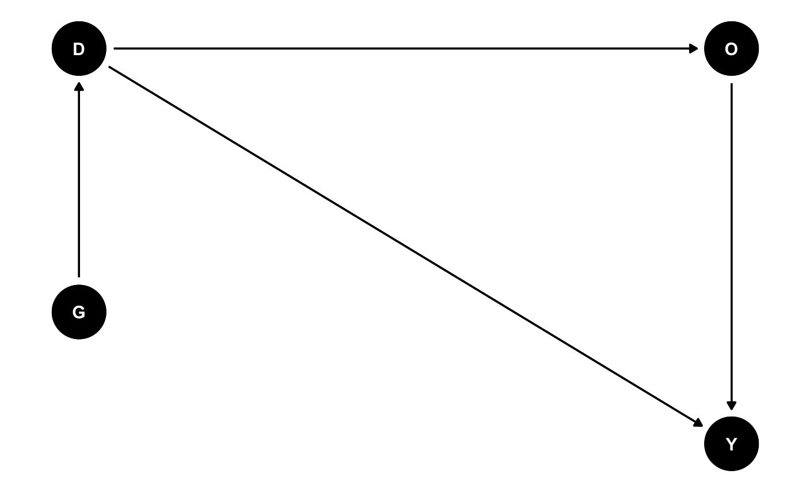

## Introduction

This is **bold** text, and this is *emphasized* text.


## Math
This is a displayed math equation:

$$ x_i^2 + y_i^2 = z_i^2 $$

And this is for inline math: $a_i=2$.

## Code
```python
def greet():
    print("Hello, world!")
```

```r 
require(stats)
centre <- function(x, type) {
  switch(type,
         mean = mean(x),
         median = median(x),
         trimmed = mean(x, trim = .1))
}
x <- rcauchy(10)
centre(x, "mean")
```

## An image
Adding a sample image 




