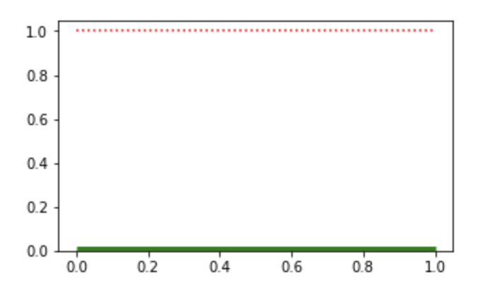
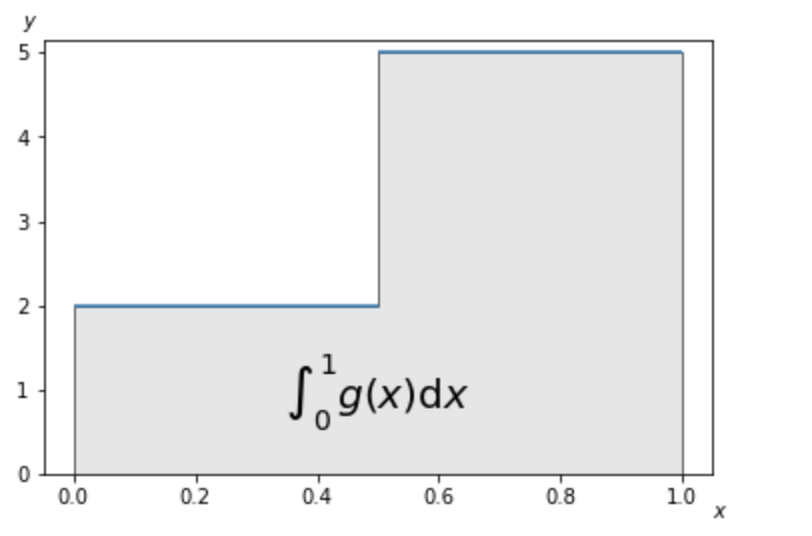
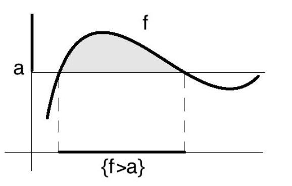
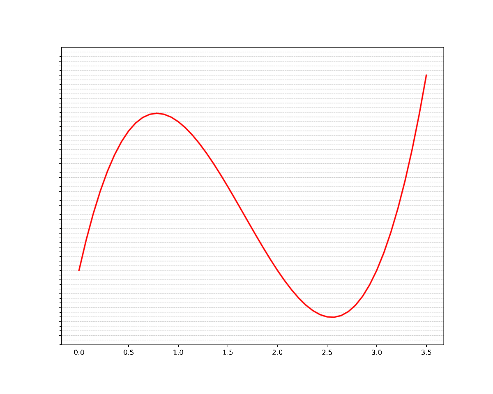


- Conjuntos nulos, sigmas álgebras, sigma álgebra de los conjuntos medibles
  - Teorema de existencia de la medida de Lebesgue, propiedades de la medida de Lebesgue
  - Teorema de la continuidad de la medida
  - Funciones medibles, funciones simples
  - Proposición: equivalencia de funciones medibles
  - Teorema: f medible, existe funciones simples convergentes.
  - Integral para funciones simples
  - Integral para funciones no negativa
  - Teorema (propiedades de la integral)
  - Teorema de la convergencia monótona


Notas preparadas para dar el final de la materia Análisis Avanzado - 2C del 2021.

# 0. Introducción (5 min)

**Motivación** 

Sea la siguiente función $f:[0,1]\to \R$ definida de la siguiente forma:

$$
f(x)=\begin{cases} 
1 \quad \text{si}\quad x \in \mathbb{Q} \\
0 \quad \text{si}\quad x \notin \mathbb{Q}
\end{cases}
$$

<!-- 

 -->

Esta función no es integrable si usamos la definición de integral de Riemann pero el objetivo será definir una integral para la cual la función anterior sí sea integrable. De esta forma, nos enfocaremos en extender la definición de integral. 

Previamente, veamos qué condiciones debería satisfacer esta definición de integral para que tenga sentido. La idea de la integral será, como en la integral de Riemann, integrar áreas bajo curvas, por lo que la integral de Lebesgue será una generalización de este concepto. 

$$
¿\exist \int_{0}^{1} f ~dx?
$$

La pregunta es entonces, ¿cómo definimos ahora la integral para que cumpla con esta condición? Recordando que la idea será integrar el área bajo curvas, veamos ahora otro ejemplo $g:[0,1] \to \R$

$$
g(x) =
\begin{cases}
2, \quad x \in A:=[0,1/2) \\ 
5, \quad x \in B:=[1/2, 1] 
\end{cases}
$$

En este caso, $\int_0^1 g ~\mathrm{d}x = 2 \cdot \frac{1}{2} + 5 \cdot \frac{1}{2} = \frac{7}{2}$, que sería el área de los dos rectángulos. Concretamente, lo que realizamos acá fue $2$ por la longitud del primer intervalo más $5$ por la longitud del segundo intervalo.  O mejor dicho, $2$ por la **medida** de A más $5$ por la **medida** de B. 

$$
\int_0^1 g ~\mathrm{d}x 
= 2 \cdot \operatorname{long}(0, \frac{1}{2}) + 5 \cdot \operatorname{long}(\frac{1}{2},1) = 2 \cdot \mu(A) + 5 \cdot \mu(B)
$$

Aplicando esta idea a la primera función $f$, obtendremos lo siguiente:

$$
\int_{0}^{1} f  ~\mathrm{d}\mu \stackrel{?}{=} 1 \cdot \mu(\mathbb{Q}\cap[0,1]) + 0 \cdot \mu\left((\R \setminus\mathbb{Q})\cap[0,1]\right)
$$

Por lo que ahora nos enfocaremos a definir la noción de **medida** de un conjunto, que no es necesariamente un intervalo en $\R$. I.e. generalizaremos la idea de longitud tratando de que cumpla estas propiedades: 

- Si $U=(a,b)$ es un intervalo con $a<b$, la medida es igual a la longitud:
  
  $$
  \operatorname{long}(U) = \begin{cases}
b-a, \quad \text{si a,b son finitos} \\ 
+\infty, \quad \text{si alguno es infinito}
\end{cases}
  $$

- Monotonía: $A\sub B \implies \mu(A) \leq μ(B)$

- $\mu(A \cup B) \leq \mu(A) + \mu(B)$, son iguales si $A\cap B =\emptyset$. (Nota, esto será una consecuencia de)

Antes de definir esta medida veamos una última observación:

Volviendo a nuestra función $f$ de antes, vemos que la función vale $0$ salvo en algunos “pocos” puntos: recordemos que $\mathbb{Q}$ es numerable, mientras que el cardinal de $\R \setminus \mathbb Q$ es $c,$ entonces vamos a querer que nuestra integral valga cero. 

Como queremos que la integral anterior sea 0, esto ocurre si la medida $μ(\mathbb{Q}\cap [0,1])$  es $0$. Es decir que a la integral no le va a importar los conjuntos que “miden cero” en esta noción de medida que definiremos más adelante. Lo que haremos ahora es definir **conjuntos nulos**, cuyas medidas deberán ser $0$ y notar sus propiedades. 

# 1. Conjuntos nulos, medida de Lebesgue, propiedades y conjuntos medibles (15)

Def 1.1. Conjunto nulo

Decimos que $A \sub \R$ es un **conjunto nulo** si para todo $\varepsilon >0$ existen contables intervalos abiertos $(U_n)_{n\in J}$ tales que:

$$
A \subset \bigcup_{n \in J} U_{n} \quad \text{y} \quad \sum_{n \in J} \operatorname{long}\left(U_{n}\right)<\varepsilon
$$

**Obs**.

- Todo conjunto finito es nulo
  
    Sea $A=\{x_1, x_2, \ldots, x_N\}$ y $\varepsilon >0$. Para cada $x_j, \forall j \in \{1, \ldots, N\}$ tomemos el intervalo $(x_j - \frac{\varepsilon}{4N}, x_j + \frac{\varepsilon}{4N})$, luego $\operatorname{long}(U_j)=\frac{\varepsilon}{N}$ y $\sum_{j=1}^{N} \operatorname{long}(U_j)= N \cdot  \frac{\varepsilon}{2N}  = \frac{\varepsilon}{2}< \varepsilon$

- Todo conjunto numerable es nulo
  
    Sea $A= \{x_i\}_{i\in\N}$ un conjunto numerable y sea $\varepsilon >0$. Para cada $x_i$ tomemos el siguiente intervalo $(x_i \pm \frac{\varepsilon}{2^{i+2}})$ por lo que $\operatorname{long}(U_j)=\frac{2\varepsilon}{2\cdot2^{i+1}} = \frac{\varepsilon}{2^{i+1}}$ y 
  
    $$
    \begin{align*}
    \sum_{i=1}^{\infty} \operatorname{long}(U_i) 
    &= \sum_{i=1}^{\infty}  \frac{\varepsilon}{2^{i+1}} \\
    &= \sum_{i=1}^{\infty} \frac{\varepsilon}{2} \cdot \frac{1}{2^{i}} \\
    &= \frac{\varepsilon}{2} \sum_{i=1}^{\infty} \frac{1}{2^{i}} \ = \frac{\varepsilon}{2}< \varepsilon
    \end{align*}
    $$

- Unión numerable de conjuntos nulos es nulo.
  
    Sea $\mathcal A = \bigcup_{n\in\N} A_n$ donde $\forall n \in \N, A_n$  es nulo. 
  
    Sea $\varepsilon >0$, tomemos $U_m = \bigcup_n I_{n,m} \supset A_m$ que es la unión de todos los intervalos que cubren al conjunto $A_m$, tal que $\sum_n \operatorname{long}(I_n) < \frac{\varepsilon}{2^{n+m+1}}$, entonces 
  
    $$
    \mathcal A \subset \bigcup_{m \in J} U_{m} \quad
    $$
  
    Luego la longitud es:
    $$
    \sum_{m\in\N} \operatorname{long}(U_m) \leq \sum_{m\in\N} \sum_{n\in \N} \operatorname{long}(I_{n,m}) < \sum_{m\in \N} \sum_{n\in\N} \frac{\varepsilon}{2^{n+m+1}} \\\\ = \frac{\varepsilon} {2} \cdot \sum_m\frac{1}{2^m}\sum_n\frac{1}{2^n} <\varepsilon
    $$

Recordemos que queremos “medir” conjuntos, a través de una generalización de la longitud de intervalos. Como esta medida que definiremos solo aplicara para ciertos conjuntos y no **todos** los subconjuntos de $\R$, determinemos ahora qué es “eso” que vamos a poder medir.

Def 1.2. Sigma-álgebra

Sea $X$ un conjunto y $\mathcal{A}$ una familia de subconjuntos de $X$ (o sea, $\mathcal{A} \sub \mathcal P(X)$).
Decimos que $\mathcal A$ es una **$\sigma$-álgebra** si $X \in \mathcal A$ y es cerrada por complementos (respecto a $X$) y por uniones numerables:

1. $X \in \mathcal A$
2. $X \in \mathcal A \implies X\setminus A \in \mathcal A$
3. $A_n \in \mathcal A \quad (\forall n \in \N) \implies \bigcup_{n\in\N} A_n \in \mathcal A$

Def 1.3. Sigma-álgebra de los conjuntos medibles de Lebesgue 

La σ-álgebra $\mathcal M$ generada por los intervalos abiertos y los conjuntos nulos de $\R$ es la **σ-álgebra de conjuntos medibles de Lebesgue.** 

1. $\forall A$ intervalo, $A \in \mathcal M$ 
2. $\forall A$ nulo, $A\in \mathcal M$

$\mathcal M$ es la menor con las propiedades 1. y 2. 

La definición anterior nos va a permitir determinar los conjuntos que son medibles, es decir: si tenemos con conjunto $A$ que pertenece a $\mathcal M$, podremos medir $A$ a través de la función $μ$.   Ahora estamos en condiciones de enunciar el Teorema de la existencia de la medida de Lebesgue. 

**Teorema 1.4. (Existencia de la medida de Lebesgue)**

Existe una única función $\mu$ de $\mathcal{M}$ en $[0,+\infty]$ tal que:

1. Si $A=(a, b)$, entonces $\mu(A)=b-a$.

2. **Sigma** **Subaditividad**. 
Si $A_{n} \in \mathcal{M}$ para todo $n \in \mathbb{N}$, entonces
   
    $$
    \mu\left(\bigcup_{n \in \mathbb{N}} A_{n}\right) \leq \sum_{n \in \mathbb{N}} \mu\left(A_{n}\right)
    $$
   
    **Sigma adivitidad**. Si los $A_{n}$ son disjuntos dos a dos, entonces
   
    $$
    \mu\left(\bigcup_{n \in \mathbb{N}} A_{n}\right)=\sum_{n \in \mathbb{N}} \mu\left(A_{n}\right)
    $$

3. **Regularidad.** Si $A \in \mathcal{M}$, entonces
   
    $$
    \mu(A)=\inf \{\mu(U): A \subset U \land U \text { abierto }\}
    $$
   
    Equivalencia (por abierto)

    $$
    \forall \varepsilon >0 \quad \exists U \text{ abierto } : A\sub U \land μ(U\setminus A) < \varepsilon.
    $$

    Por 3 del Teorema 1.4, $\forall \varepsilon >0, \exists U$ abierto tal que $A \sub U \land \mu(U) < μ(A)+\varepsilon$, de esto último, $μ(U\setminus A) < \varepsilon.$
- (Regularidad por cerrado)
  
    Sea $A \in \mathcal M$, entonces:
    $$
    \forall \varepsilon >0 \quad \exists F \text{ cerrado } : F\sube A \land μ(A\setminus F) < \varepsilon.
    $$

    Sea $B:= A^c \in \mathcal M$ y sea $\varepsilon > 0$. Por regularidad por abiertos:
  
    $$
    \exist U \text{ abierto }: B \sube U \land \mu(U \setminus B) < \varepsilon
    $$
  
    Sea $F=U^c$, entonces $F$ es cerrado y $F \sube B^c = (A^c)^c = A$. Además, 
  
    $$
    A \setminus F = A \cap F^c = A \cap U = B^c\cap U = U \setminus B \\
    \mu(A \setminus F) = \mu(U \setminus B) < \varepsilon
    $$

Veamos que esta medida se comporta bastante “bien”. Notemos entonces las siguientes propiedades:

- $μ(\emptyset)= 0$.
  
    Tomemos $A_1 = (0,1), A_n = \emptyset, \quad \forall n \geq2$, luego $(0,1)=\bigcup_{n=1}^{\infty} A_n$ 
    y además $A_n \cap A_m, \forall n \ne m$:
  
    $$
    \begin{align*}
    1 \underset{\text{por teo 1.}}{=}& \mu((0,1)) \\\\
    \underset{\phantom{por teo 1.}}{=}& \mu \left(\bigcup_{n\in \N} A_n \right)\\\\ 
    \underset{\text{por teo 2. }}{=}& \sum_{n \in \mathbb{N}} \mu\left(A_{n}\right) \\\\
    \underset{\phantom{por teo 1.}}{=}& \underbrace{\mu(0,1)}_{1} + \sum_2^\infty \mu(\emptyset) 
    &\implies \sum_2^\infty \mu(\emptyset) =0 \quad \therefore \mu(\emptyset) =0
    \end{align*}
    $$

- $\mu(A \cup B) \leq \mu(A) + \mu(B)$
  
    Sea $A_1 = A, A_2 =B, A_n = \emptyset$. Luego

    $$
    \begin{align*}
    \mu(A \cup B) = \mu\left(\bigcup_{n \in \mathbb{N}} A_{n}\right) &\leq \sum_{n \in \mathbb{N}} \mu\left(A_{n}\right) \quad \text{por teo 2} \\\\
    &=\mu(A)+\mu(B) + \underbrace{\sum_{n=3}^{\infty}\mu(\emptyset)}_{0} = \mu(A) + \mu(B)
    \end{align*}
    $$
  

- Si $A, B \in \mathcal M$ y son disjuntos, entonces $μ(A \cup B) = μ(A) + μ(B).$
  
    Análogo al anterior.

- **Monotonía**. Si $A, B \in \mathcal{M}$ cumplen que $A \subset B$, entonces $\mu(A) \leq \mu(B)$.
  
    $A \sub B \implies B = (B\setminus A)~\dot\cup~ A \implies \\\\
    \mu(B) = \underbrace{μ(B\setminus A)}_{\geq 0} + μ(A) \quad\therefore \mu(B) \geq \mu(A)$ 

- Sean $A, B \in \mathcal M$. Entonces, $A \setminus B \in \mathcal M$ y $μ(A \cup B) = μ(A \setminus B) + μ(B).$
  En particular, si $B \subseteq A$ y $μ(B) < \infty$, entonces $μ(A \setminus B) = μ(A) - μ(B).$

    Sea $A, B \in \mathcal M$, entonces $A \setminus B = A \cap B^c \in \mathcal M$ pues complemento e intersección de medible es medible. 
    Además
  
    $$
    \begin{align*}
    A \cup B &= A\setminus B ~\dot\cup~ B \\\\
    \mu(A \cup B) &= \mu(A\setminus B) + \mu(B) \,\text{ por aditividad} \\\\
    \text{ Si }B\sube  A,\quad A \cup B &= A  \\\
    \mu(A ) &= \mu(A\setminus B) + \mu(B) \quad\text{ como $\mu(B)<\infty$, tiene sentido restar}\\\\
    \mu(A)-\mu(B)&=\mu(A\setminus B) 
    \end{align*}
    $$

- Si $A \subset \mathbb{R}$ es un conjunto nulo, entonces $A \in \mathcal{M}$ y $\mu(A)=0$. Recíprocamente, si $A \in \mathcal{M}$ es tal que $\mu(A)=0$, entonces $A$ es un conjunto nulo.
  
    $\implies)$ Sea $A$ nulo, entonces $A \in \mathcal M$ y $\mu(A)=0$.
  
    $A\in \mathcal{M}$ por definición de $\mathcal M$. Ahora, sea $\varepsilon >0,$ como $A$ es nulo: $\exists (U_n)\_{n\in\N}$ 
    intervalos abiertos: $A \sube \bigcup_{n} U_n \land \sum_n \operatorname{long}(U_n) < \varepsilon$. 
    Entonces: 
  
    $$
    \begin{align*}
    \mu(A) &\leq \mu(\bigcup_n U_n) \quad \text{por monotonía} \\\\
    &\leq \sum_n \mu(U_n) \quad\text{por adividad} \\\\
    &= \sum_n \operatorname{long}(U_n)<\varepsilon \quad\text{por teo 1.4.1, pues $U_n$ es un intervalo} \\\\
    \implies \mu(A) &< \varepsilon \quad\forall \varepsilon >0 \\\\
    \implies \mu(A) &= 0. 
    \end{align*}
    $$
  
    $\Longleftarrow)$ Si $\mu(A)=0$, entonces $A$ es nulos.  Sea $\varepsilon >0$ y $A \in \mathcal M$, por regularidad por abiertos $\exist U \text{ abierto }: A \sube U \land \mu(U \setminus A) < \varepsilon$. Ahora, 
  
    $$
    \mu(U) = \mu(U\setminus A)+ \underbrace{\mu(A)}_{0 \text{ por hip.}} = \mu(U \setminus A) < \varepsilon
    $$
  
    Además, si $U$ es un abierto en $\R$, entonces $U= \dot\bigcup_n I_n$ (unión de intervalos abiertos disjuntos), 
  
    $$
    A \sube \dot\bigcup_n I_n=U \land \sum_n \operatorname{long}{I_n}=\sum_n \mu(I_n) \underset{\text{disjuntos}}{=}\mu(\bigcup_n I_n) = \mu(U) < \varepsilon \\
    \therefore A \text{ es nulo}
    $$

- **Invariante por translación.** Dados $A \in \mathcal{M}$ y $c \in \mathbb{R}$, se tiene que $A+c \in \mathcal{M}$ y$\mu(A+c)=\mu(A).$
  
    Sea $\lambda\in\R$ y sea $\nu:\mathcal M \to [0, \infty]: \nu(A) = μ( \lambda + A)$, quiero ver que $\nu$ cumple con las tres propiedades de medida, si las cumple, por unicidad concluiremos que la medida es invariante por translación. 
  
    Separemos en casos
  
  1. Si $A=(a,b)$, entonces $\nu(a,b)=μ(λ + (a,b))= μ((a+\lambda, b+\lambda))=b+ λ - a+\lambda = b-a$ 
  
  2. Si $A_n \in \mathcal M$, 
     
      $$
      \begin{align*}
      \nu\left(\bigcup_n A_n \right) &= \mu\left( \lambda + \bigcup_n A_n  \right) \\\\ &=\mu\left( \bigcup_n  (\lambda +A_n)  \right) \\\\ 
      &\leq \sum_n \underbrace{\mu(\lambda+A_n)}_{\nu(A_n)} \quad \text{por subaditividad de la medida} \\\\ \therefore~ \nu\left(\bigcup_n A_n \right)  &\leq \sum_n \nu(A_n)
      \end{align*}
      $$
     
      Luego, como $\nu$ es inyectiva si $A_n \cap A_m =\emptyset ~\forall n \ne m$, entonces: $\nu(A) \cap \nu(A_m) = \emptyset$. Siguiendo un desarrollo similar:
     
      $$
      \mu\left( \bigcup_n  (\lambda +A_n)  \right) = \sum_n \underbrace{\mu(\lambda+A_n)}_{\nu(A_n)}\\
      \implies\nu\left(\bigcup_n A_n \right)  =\sum_n \nu(A_n)
      $$
  
  3. Sea $A \in \mathcal M$, quiero ver que: $\nu(A) = \inf\{ \nu(U) : A \sube U \land U \text{ abierto}\}$.
     
      $$
      \begin{align*}
      \nu(A) &= \inf\{ \nu(U) : A \sube U \land U \text{ abierto}\} \\\\
      \mu(\underbrace{\lambda + A}_{=:B}) &= \inf\{ \mu(\lambda + U) : A \sube U \land U \text{ abierto}\} \\\\
      \mu(B) &= \inf\{ \mu(V) :B \sube V\land V \text{ abierto}\}
      \end{align*}
      $$
     
      Y notemos que $\nu$ es biyectiva y homeomorfa, entonces: 
     
      $$
      \begin{align*}
      \{  A \sube U \land U \text{ abierto}\} &\sim \{ B \sube V\land V \text{ abierto}\} \\\\ U &\mapsto U+\lambda \\\\ V-\lambda &\gets\!\shortmid V \\\\ 
      \therefore \{  A \sube U \land U \text{ abierto}\} &= \{ B \sube V\land V \text{ abierto}\}
      \end{align*}
      $$

**Teorema 1.5. (continuidad de la medida)**

Sea $\left\{A_{n}\right\}_{n \in \mathbb{N}} \subset \mathcal{M}$ tal que (creciente) 
$A_{1} \subset A_{2} \subset A_{3} \cdots \subset A_{n} \ldots$
Entonces

$$
\mu\left(\bigcup_{n \in \mathbb{N}} A_{n}\right)=\lim_{n \rightarrow \infty} \mu\left(A_{n}\right)

$$

Sea $\left\{B_{n}\right\}_{n \in \mathbb{N}} \subset \mathcal{M}$ tal que (decreciente) $B_{1} \supset B_{2} \supset B_{3} \cdots \supset B_{n} \ldots$ y supongamos que existe un $n_{0} \in \mathbb{N}$ con $\mu\left(B_{n_{0}}\right)<\infty$.
Entonces

$$
\mu\left(\bigcap_{n \in \mathbb{N}} B_{n}\right)=\lim_{n \rightarrow \infty} \mu\left(B_{n}\right)
$$

- Demostración
  
    Sea $\left\{A_{n}\right\}_{n \in \mathbb{N}} \subset \mathcal{M}$, disjuntemos primero a los $A_n$ para que sean disjuntos:
  
    $$
    \begin{align*}
    \tilde{A_1} &:= A_1 \\
    \tilde{A_2} &:= A_2 \setminus A_1 \\ \tilde{A_3} &:= A_3 \setminus A_2 \\ &\vdots \\\tilde{A_n} &:=A_n \setminus A_{n-1} \quad\forall n\in\N \land \tilde{A_n} \in \mathcal M
  
    \end{align*}
    $$
  
    Entonces tenemos que $\tilde{A_n} \cap \tilde{A_m} = \emptyset \quad \forall n \ne m$ y además:
  
    $$
    \forall N\in\N\quad \bigcup_{n=1}^N \tilde{A_n}= A_N \implies \bigcup_{n\in\N} \tilde{A_n}= \bigcup_{N\in \N}A_N 
    $$
  
    Por lo tanto:
  
    $$
    \begin{align*}
    \mu\left(\bigcup_{N\in \N}A_N \right) &= \mu\left(\dot\bigcup_{n\in\N} \tilde{A_n}\right) \\&= \sum_{n=1}^\infty \mu(\tilde{A_n}) \quad\sigma\text{-aditividad} \\&=\lim_{N\to\infty} \sum_{n=1}^N \mu(\tilde{A_n}) \quad\text{def. de serie}\\
    &=\lim_{N\to\infty} \mu\left(\bigcup_{n=1}^N \tilde{A_n}\right) \quad\text{ aditividad} \\&=\lim_{N\to\infty} \mu(A_N)
    \end{align*}
    $$
  
    Para el segundo ítem,  sea $\left\{B_{n}\right\}_{n \in \mathbb{N}} \subset \mathcal{M}$ tal que *(decreciente)* $B_{1} \supset B_{2} \supset B_{3} \cdots \supset B_{n} \ldots$ consideremos la siguiente sucesión:
  
    $$
    \begin{align*}
    A_1 &:= B_1 \setminus B_1 = B_1 \cap B_1^c= \emptyset \\
    A_2 &:= B_1 \setminus B_2 =B_1 \cap B_2^c\quad\text{obs.}A_1 \sub A_2 \\ A_3 &:= B_1 \setminus B_3 =B_1 \cap B_3^c \quad\text{obs.}A_1 \sub A_2 \sub A_3\\ &\vdots \\{A_n} &:=B_1 \setminus B_{n}=B_1\cap B_n^c \quad\forall n\in\N \land {A_n} \in \mathcal M \land A_1 \sub A_2 \dots \sub A_n
    \end{align*}
    $$
  
    Entonces, por lo anterior sabemos que 
  
    $$
  
    \mu\left(\bigcup_{n \in \mathbb{N}} A_{n}\right)=\lim_{n \rightarrow \infty} \mu\left(A_{n}\right)
  
    $$
  
    Notemos que además:
  
    $$
    \bigcup_{n \in \mathbb{N}} A_{n} = B_1 \cap (\bigcup_{n\in\N}B_n^c) =B_1 \cap (\bigcap_{n\in\N}B_n)^c = B_1 \setminus\bigcap_{n\in\N}B_n \\ \bigcap_n B_n \sub B_{n_0}
    $$
  
    Luego, asumamos que $\exist n_0: μ(B_{n_0})<\infty \land n_0 =1$ . Pues como estamos tomando intersección, si tenemos que $\mu(B_i) = \infty, \quad \forall i=1,\ldots,n_0-1$ podemos descartar todos esos conjuntos. 
  
    $$
    \begin{align*}
    \mu\left(\bigcup_{n \in \mathbb{N}} A_{n}\right)&= \lim_{n\to\infty}\mu(A_n)\\&= \lim_{n \rightarrow \infty} \mu\left(B_1 \setminus B_n\right) \\&= \mu(B_1)-\lim_{n \rightarrow \infty} \mu\left( B_n\right)
    \\
    \mu\left(\bigcup_{n \in \mathbb{N}} A_{n}\right)&= \mu\left( B_1 \setminus\bigcap_{n\in\N}B_n\right)\\&= \mu(B_1)-\mu\left( \bigcap_{n\in\N}B_n\right) 
    \end{align*}\\
    \therefore ~
    \mu\left(\bigcap_{n \in \mathbb{N}} B_{n}\right)=\lim_{n \rightarrow \infty} \mu\left(B_{n}\right)
  
    $$

A partir lo visto anteriormente, estamos ahora en condiciones de calcular la la parte derecha de la igualdad 

$$
\int_{0}^{1} f  ~\mathrm{d}\mu \stackrel{?}{=} 1 \cdot \mu(\mathbb{Q}\cap[0,1]) + 0 \cdot \mu\left((\R \setminus\mathbb{Q})\cap[0,1]\right)
$$

Calculemos entonces la medida de $μ(\mathbb{Q} \cap [0,1])$  y $μ((\R \setminus \mathbb{Q}) \cap [0,1])$. 

- $(\mathbb{Q} \cap [0,1]) \sub \mathbb{Q} \sim \N$, luego $\mathbb{Q} \cap [0,1]$ es un conjunto nulo por ser subconjunto de un conjunto nulo (y medible).
- $(\R \setminus \mathbb{Q}) \cap [0,1] \in \mathcal M$ pues $\R\setminus \mathbb Q\in\mathcal M$ y $[0,1] \in \mathcal M$, luego la intersección también estará en $\mathcal M$. 
  Notemos que $(\R \setminus \mathbb{Q}) \cap [0,1] = [0,1] \setminus( \mathbb Q \cap [0,1])$, luego:

$$
\begin{align*}
\mu(\R\setminus \mathbb Q \cap [0,1]) &= \mu([0,1] \setminus( \mathbb Q \cap [0,1]))\\&= \mu([0,1])-\mu(\mathbb Q \cap [0,1])\\&= 1-0 \\ &=1 \\\therefore 

\mu(\R\setminus \mathbb Q \cap [0,1])&=1
\end{align*}
$$

Concluimos entonces que  

$$
1 \cdot \mu(\mathbb{Q}\cap[0,1]) + 0 \cdot \mu\left((\R \setminus\mathbb{Q})\cap[0,1]\right) = 0
$$

Ahora obtenida la parte derecha de la igualdad, veamos cómo definimos la integral para que esto valga. Notemos que este tipo de razonamiento sirve para funciones similares a $f$, nos concentraremos en este parte a definir las funciones simples y funciones medibles, que serán generalizaciones de estas funciones que estuvimos viendo. 

# 2. Funciones simples y funciones medibles (15)

Def. 2.1. Partición medible 

Sea $E \sub \R$ medible, una **partición medible** de $E$ es una colección de conjuntos $(E_n)_n$ medibles de conjuntos disjuntos dos a dos tq:

$$
E = \bigcup_{n} E_n
$$

Def. 2.2. Función simple

Una función $f:E \to \R$ se dice **simple medible** si existe una partición de $E$ (medible) en finitos conjuntos $E_1, \ldots E_N$, todos medibles y números $\alpha_1, \ldots, \alpha_N \in \R$ tales que:

$$
f(x)=\sum_{n=1}^{N} \alpha_{n} \chi_{E_{n}}(x)
$$

Si los $E_n$ son intervalos, decimos que $f$ es simple escalonada o **escalonada**.

Observaciones (de funciones simples)

- $f$ simple $\iff \operatorname{Im} f = \{\alpha_1, \ldots, \alpha_N\}$ es un conjunto finito.
  
    $\implies$
  
    $$
    f(x)=\sum_{n=1}^{N} \alpha_{n} \chi_{E_{n}}(x) \implies Im(f) =\{\alpha_i:i=1,\ldots,N \}
    $$
  
    $\Longleftarrow$
  
    $$
    Im(f)=\{\alpha_i\} \land E_i:=\{x\in E:f(x)=\alpha_i\}
    \\ \implies f = \sum \alpha_i \Chi_{E_i}
    $$

- Una función simple $f : E \to \R$ siempre se puede pensar como definida en todo $\R$, extendiéndola para que valga $0$ fuera de *E*. La extensión sigue siendo simple porque a lo sumo agregamos un elemento a la imagen.

- $f$ simple $\implies |f|, f^2, e^f$ simples (pues sus imágenes serán también finitas)

- $f, g$ simples; $s,t \in \R \implies sf+tg$ simple
  
    Sea $f, g$ funciones simples, entonces $Im(f)=\{\alpha_1, \dots, \alpha_N\} \land Im(g)=\{\beta_1, \dots, \beta_M\}$. Por lo tanto, $Im(sf+tg)=\{sα_n+tβ_m: 1\leq n\leq N \land 1 \leq m\leq M\}$, que es finito.

Notemos que la función $f$ que queremos integral es una función simple, pues es la función característica de los racionales entre 0 y 1. Una característica importante de la medida de Lebesgue, es que no solo se va a “comportar” bien para funciones simples, sino que también será bueno para unas clases de funciones más generales: llamada funciones medibles. A continuación, vamos a caracterizar este tipo de funciones y observar que incluyen una gran cantidad de funciones, lo cual indicaría la gran utilidad de esta integral que definiremos a posteriori. 

Def. 2.3. Función medible 

Sea $X \sube \R$ medible y $f: X \to \bar{R}$, decimos que $f$ es **medible** si $\forall a\in \R$ 

$$
f^{-1}([-\infty, a])) = \{x \in E: f(x) \leq a\} \\ =\{f \leq a \} \text{ es medible}
$$

Proposición 2.4. (Equivalencias de $f$ medible)

Sea $E$ medible y $f:E\to\overline{\R}$. Son equivalentes. 

1. $f$ es medible, para todo $a\in\R$, el conjunto $\{x\in E: f(x)\leq a\}$ es medible. 
2. Para todo $a\in \R$, el conjunto $\{ x \in E : f(x) < a\}$ es medible. 
3. Para todo $a\in \R$, el conjunto $\{ x \in E : f(x) \geq a\}$ es medible. 
4. Para todo $a\in \R$, el conjunto $\{ x \in E : f(x) > a\}$ es medible. 
- Demostración
  
    Demostraremos que $a) \implies b) \implies c) \implies d) \implies a)$. 
  
  1. $a\implies b$
     
     Afirmo que $[-\infty, a) = \bigcup_{n\in\N}[-\infty, a-\frac{1}{n}]$, luego si esto vale,
     
     $$
     f^{-1}([-\infty, a))= f^{-1}\left(\bigcup_{n\in\N}\left[-\infty, a-\frac{1}{n}\right]\right)= \underbrace{\bigcup_{n\in\N}f^{-1} \underbrace{\left[-\infty, a-\frac{1}{n}\right]}\_{\text{medible por hipótesis}}}\_{\text{medible por unión numerable de med.}}
     $$
     
     Veamos que la afirmación es válida:
     
     $[-\infty, a) = \bigcup_{n\in\N}[-\infty, a-\frac{1}{n}]$
     
     Si tomo un $b \in [-\infty, a)$, entonces
     
     $$
     -\infty\leq b<a \implies \exist n\in \N: -\infty\leq b \leq a-\frac{1}{n} \\\implies b \in \bigcup_{n\in\N}\left[-\infty, a-\frac{1}{n}\right]
     $$
     
     Recíprocamente. Sea $b\in \bigcup_{n\in\N}[-\infty, a-\frac{1}{n}]$, entonces
     
     $$
     \exist m\in \N: b\in \left[-\infty, a-\frac{1}{m}\right] \\\implies -\infty\leq b \leq a-\frac{1}{m} < a\\\implies b \in [-\infty, a)
     $$
  
  2. $b \implies c$
     
      Notemos que $[-\infty, a)^c = [a, \infty]$. Luego 
     
      $$
      f^{-1}([a, \infty]) = f^{-1}([-\infty, a)^c) = \underbrace{E}\_{med}\setminus \underbrace{f^{-1}([-\infty, a))}\_{\text{med x hip.}}
      $$
     
      Por lo tanto, es medible pues el complemento de un medible es medible.
  
  3. $c \implies d$
     
      Veamos que $f^{-1}((a,+\infty])$ es medible pues si vale $c)$ y además $(a,+\infty]= \bigcup_n [a+\frac{1}{n}, +\infty]$, entonces se verifica que $f^{-1}((a,+\infty])$ es medible pues es unión numerable de medible.
  
  4. $d\implies a$
     
      Se sigue de que $\{f\geq a\} = E \setminus \underbrace{\{f>a\}}_{\text{med}}$, luego como $\mathcal M$ es un $\sigma$-álgebra, entonces $\{f\geq a\}$ es medible. 

Gráficamente, una función es medible si “manda para atrás” semirrectas a conjuntos medibles. 

$f$ manda para atrás el intervalo $(a, +\infty]$ a un intervalo en $\R$.

Observación

Existen una gran cantidad de funciones que son medibles, de hecho es más difícil encontrar ejemplos de funciones medibles que no medibles.

- $f$ simple es medible
  
    $$
    f^{-1}(-\infty,a] = \bigcup\{E_i : i\in\{1,\ldots,n\}\ \land  a_i\le a\}
    $$

- $f:\R \to \R$ continua es medible
  
    Sea $a \in \R$, 
  
    $$
    \underbrace{f^{-1}(\underbrace{(-\infty, a]}_\text{cerrado})}_{\text{cerrado, luego medible. }} 
    $$
  
    *Recordar que* $f$ *continua, manda de cerrado/abierto para atrás.* 

- $f$ monótona es medible
  
    Ver que $\{f\leq a\}$ es siempre un intervalo, luego es medible. 

- Combinación lineal de medibles es medible.
  
    Sea $\{q_n\}_{n\in\N}$ una numeración de $\mathbb Q$, entonces:
  
    $$
    f(x)+g(x) > a \iff f(x)> a -g(x) \iff \exist n : f(x) > q_n > a-g(x)  \\\{f+g > a\} = \bigcup_n \{f> q_n\} \cap \{g > a-q_n\}
    $$
  
    Sea $\alpha \in \R$ y $f$ medible:
  
  - Si $\alpha=0$, entonces $\alpha \cdot f = 0$ es medible.
  - Si $\alpha >0$, entonces $\{\alpha f>a\}=\{ f > \frac{a}{\alpha}\} \in \mathcal M$
  - Si $\alpha <0$, entonces $\{\alpha f>a\}=\{ f < \frac{a}{\alpha}\} \in \mathcal M$

- Producto de medibles es medible.
  
    Sea $f$ medible, $f^2$ es medible: 
  
    $$
    \{ f^2 \leq a\} = \begin{cases}
    \emptyset &\text{si } a<0\\
    \{ -\sqrt{a}\leq f \leq \sqrt{a}\}= \{f \leq \sqrt{a} \} \cap \{f\geq-\sqrt{a}\} &\text{ si } a\geq0
    \end{cases}
    $$
  
    Luego $f, g$ medible, implica:
  
    $$
    f\cdot g = \frac{(f+g)^2 - (f-g)^2}{4} \text{ es medible}
    $$
  
    pues combinación lineal de medible es medible. 

- Supremo o ínfimo de una suc. de funciones medibles es medible.
  
    $$
    \{\, \def\S {\sup_k\ f_k} \S >a\, \} = \bigcup_k\ \{\, f_k > a\, \}
    $$
  
    Pues $\sup f_n >a \iff \exist n: f_n >a$. 

- Límite puntual de una suc. de funciones medibles es medible.
  
    Sea $(f_n)_n$ sucesión de medibles y sea $f=\lim_{n\to\infty}f_n$. Veamos que $f$ es medible. Ie.: $\{x:f(x) >a\}$ es medible. 
  
    $$
    f(x) > a \iff \exist m\in\N:f(x)>a+\frac{1}{m} \\
    \iff (\exist m\in\N)~(\exist n_0 \in \N): f_n(x) > a+\frac{1}{m} \quad\forall n\geq n_0 \\
    \therefore \{f>a\}\underset{*}{=}\bigcup_m \bigcup_{n_0} \bigcap_{n\geq n_0}\{x:f_n(x) > a+\frac{1}{m}\}
    $$
  
    Probemos $(*)$
  
  - $\sube,\quad x\in \{f > a\} \implies (\exist m\in\N)~(\exist n_0 \in \N): f_n(x) > a+\frac{1}{m}$
  - $\supseteq, \quad x \in \bigcup_m \bigcup_n \bigcap_{n\geq n_0}\{x:f_n(x) > a+\frac{1}{m}\} \implies (\exist m\in\N)~(\exist n_0 \in \N) ...$

📌 **Teorema** 2.5.

Sea $f: E \rightarrow[0,+\infty]$ medible. Entonces, existe una sucesión creciente $\left(f_{n}\right)_{n}$ de funciones simples no negativas que converge puntualmente a $f$ en $E$:

$$
0 \leq f_{n}(x) \leq f_{n+1}(x) \quad \forall x \in E, n \in \mathbb{N} \quad \text { y } \quad f(x)=\lim_{n \rightarrow \infty} f_{n}(x) \quad \forall x \in E .
$$

Si $f$ es acotada, la sucesión converge a $f$ uniformemente en $E$.

- Demostración
  
    Sea $f$ medible, tomemos $\forall n\in\N:$
  
    $$
    E^n =\{x \in E:f(x) < n \}
    $$
  
    Y la partición medible de $E^n$:
  
    $$
     E^n_j=\{x\in E: \frac{j-1}{2^n}\leq f(x) <\frac{j}{2^n} \}=f^{-1}\left(\left[ \frac{j-1}{2^n},\frac{j}{2^n} \right)\right) \quad \forall j\in\{1, \ldots, n\cdot2^n\}
    $$
  
    Definamos ahora la función $f_n:E \to\R$
  
    $$
    f_n:= \begin{cases}
    \frac{j-1}{2^n} &\quad\text{si } x\in E_j^n \\ n &\quad\text{si }f(x) \geq n 
    \end{cases} = \sum_{j=1}^{n2^n} \frac{j-1}{2^n}\Chi_{E^n_j} + n \Chi_{\{f \geq n\}}
    $$
  
    Se observa que $f_n$ es simple para todo $n\in\N$, pues toma finitos valores y $f_n$ es medible (pues $E^n_j$ son medibles y $\R\setminus E^n_j$ también). Claramente $f_n$ es no negativa, veamos que $(f_n)_n$ es creciente. Ie.: $f_n(x) \leq f_{n+1}(x)$:
  
  - Si $x \in E^n_j$, entonces:
    
      $$
      \begin{align*}
      \frac{j-1}{2^n} \leq f(x) < \frac{j}{2^n} \\
      \iff& \frac{2(j-1)}{2\cdot2^n} \leq f(x) <\frac{2j}{2\cdot2^n}  \\
      \iff& \frac{2j-2}{2^{n+1}} \leq f(x) < \frac{2j}{2^{n+1}}  \\
      \iff& \underbrace{\frac{2j-2}{2^{n+1}} \leq f(x) <\frac{2j-1}{2^{n+1}}}_{\text{Caso 1}}  ~\lor~ \underbrace{\frac{2j-1}{2^{n+1}} \leq f(x) <\frac{2j}{2^{n+1}}}_{\text{Caso 2}}\\
    
      \end{align*}
      $$
    
      Si $x$ cae en el caso 1:
    
      $$
      f_n(x) = \frac{j-1}{2^n} = \frac{2(j-1)}{2^{n+1}}=f_{n+1}(x)
      $$
    
      Si $x$ cae en el caso 2:
    
      $$
      f_n(x) = \frac{j-1}{2^n} \leq \frac{2j-1}{2^{n+1}}=f_{n+1}(x)
      $$
  
  - Si $x$ es tal que $f(x) \geq n$, se puede ver que $f_n(x)=n \leq f_{n+1}(x)$.
    
    - Si $x\mid n\leq f(x) <n+1$, entonces basta ver que:
      
      $$
      \begin{align*} 
&f_n(x)=n \leq f_{n+1}(x)=\frac{j-1}{2^{n+1}} \text{ con }j=n2^{n+1}+1, \ldots,(n+1)2^{n+1} \\
&\iff n \leq \frac{j-1}{2^{n+1}} \\
&\iff n\cdot 2^{n+1}+1 \leq j 
\end{align*}
      $$
    
    - Si $x \mid n+1 \leq f(x)$, entonces $f_n(x) = n \leq f_{n+1}=n+1.$
    
    Luego, veamos que $\lim_{n\to \infty} f_n(x)=f(x)\quad\forall x \in E$:
  
  - Caso 1
    
      Sea $x:f(x)=+\infty$, 
    
      $$
      \begin{align*}
      f(x)\geq n \quad\forall n\in \N
      &\implies f_n(x)=n \quad\forall n\in \N \\
      &\implies \lim_{n\to\infty} f_n(x)=\lim_{n\to\infty} n = +\infty = f(x)
      \end{align*}
      $$
  
  - Caso 2
    
      Si $f(x) <+\infty\implies \exist n_0: f(x) < n_0 \leq n \quad\forall n\geq n_0$ 
    
      $$
      \begin{align*} 
      &\implies f(x) < n \quad\forall n\geq n_0\\
      &\implies x \in E^n_j \text{ para algún }j\\
      &\implies \underbrace{\frac{j-1}{2^n}}_{f_n(x)} \leq f(x) < \frac{j}{2^n} \\
      &\implies f_n(x)-f_n(x)=0 \leq f(x)-f_n(x) < \frac{j-1}{2^n}-\frac{j}{2^n}=\frac{1}{2^n}\\
      &\implies |f_n(x)-f(x)| < \frac{1}{2^n} \longrightarrow 0 \quad \forall n \geq n_0 \\
      &\implies f_n(x) \underset{n\to\infty}{\longrightarrow} f(x)
    
      \end{align*}
      $$
    
    ---
    
    Notar que si $f$ es acotada, entonces $\exist M \in \N: f(x) \leq M ~\forall x\in E$. Luego tomando $n \geq M$, se tiene que:
    
    $$
    |f_n(x)-f(x)| < \frac{1}{2^n} \longrightarrow 0 \quad \forall n \geq M,~\forall x \in E
    $$

Def 2.6. Casi todos los puntos 

Decimos que una propiedad vale en **casi todo punto** si el conjunto de los $x$ **en los que no vale tiene medida $0$.

# 3. Integral de Lebesgue para funciones medibles no negativas y TCM (15)

Ahora sí definiremos la integral de Lebesgue, comencemos por la definición de integral para funciones simples 

Def. 3.1. Integral de Lebesgue de funciones simples

Sean $\{E_i\}_{i=1}^n$ una partición medible de $E$ y $f:E\to\R$ una función simple dada por:

$$
f(x) = \sum_{i=1}^n \alpha_i \chi_{E_i}(x). 
$$

Definimos a la **integral de Lebesgue** de $f$ simple como:

$$
\int_{E} f \,d \mu:=\sum_{i=1}^{n} \alpha_{i} \mu\left(E_{i}\right)
$$

Notemos que a partir de esto:$\int {\Chi_A}~d\mu = \mu(A)$ generalizamos de alguna forma que $\int_a^b 1 ~dx = \operatorname{long}((a,b))$

📌 Proposición (propiedades de la integral sobre funciones simples)

Si $f, g:E\to\R$ funciones simples y $a,b\in\R$. Entonces

- **Linealidad.** $\int_{E} a f+b g ~d\mu = a\int_{E} f ~d\mu + b \int_{E} g~ d\mu.$
  
    Sea $f= \sum_{i=1}^N \alpha_i \Chi_{E_i}, g= \sum_{j=1}^M \beta_i \Chi_{\tilde{E}_j}$, consideremos $A_{ij}= E_i \cap \tilde{E}_j$ (una partición medible de $E$). Notemos que $E_i = \bigcup_j^M A_{ij} = E_i \cap \bigcup_j^M\tilde{E}_j = E_i \cap E$ , análogcamente con $\tilde{E}_j$:
  
    $$
    \begin{align*}
    \text{Si } x \in A_{ij} &\implies af(x)+bg(x)=a\alpha_i+b\beta_j \\ \implies (af+bg )(x) &=\sum_i^N\sum_j^M (a\alpha_i+b\beta_j)\Chi_{A_{ij}}(x) \\
    \implies \int_E  (af+bg ) ~d\mu &=\sum_i^N\sum_j^M (a\alpha_i+b\beta_j)\mu({A_{ij}}) \quad \text{ por def. de int (simple) } \\&=\sum_i \sum_j a \alpha_i\mu(A_{ij}) + \sum_i \sum_j b \beta_i \mu(A_{ij}) \\ &= \sum_i^N a \alpha_i \sum_j^M \mu(E_i \cap \tilde{E}_j) + 
    \sum_j^M b \beta_j \sum_i^N \mu(E_i \cap \tilde{E}_j) \\ &=\sum_i^N a \alpha_i  ~\mu(\bigcup_j^ME_i \cap \tilde{E}_j) + 
    \sum_j^M b \beta_j ~ \mu(\bigcup_i^N E_i \cap \tilde{E}_j) \\ &=
    \sum_i^N a \alpha_i  ~\mu(E_i) + 
    \sum_j^M b \beta_j ~ \mu(E_j) \\&=a\int_E f ~d\mu + b \int_E g ~d\mu
    \end{align*}
    $$

- **Monotonía.** si $f \leq g$ en $E$, $\int_{E} f ~d \mu \leq \int_{E} g ~d \mu.$
  
    Forma 1.
  
    $$
    \begin{align*}
    f\leq g \implies \\ 
    \int_E f ~d\mu&=\sum_{i=1}^N \alpha_i\mu(E_i) \quad\text{ por def.} \\
    &= \sum_{i=1}^N \alpha_i~\mu(\dot\bigcup_{j=1}^M E_i \cap \tilde{E}_j) 
    \\
    &= \sum_i^N \sum_j^M \alpha_i \mu(E_i \cap \tilde E_j) \quad\text{ por adtv.}\\
    &\leq \sum_i^N \sum_j^M \beta_i \mu(E_i \cap \tilde E_j) \quad\text{ pues $f(x)\leq g(x)$}\\
    &= \sum_j \beta_j\sum_i^N\mu(E_i \cap \tilde E_j)
    \\ &= \sum_j \beta_j \mu(\tilde{E}_j)=\int_E g~d\mu 
  
    \end{align*}
    $$
  
    Forma 2.
  
    Si $f\leq g$, entonces $g-f$ es una función simple no negativa, luego:
  
    $$
    \begin{align*}
    \int_E g -f &\geq 0 \\
    \int_E g -\int_E f &\geq 0 \quad\text{ por linealidad} \\ \therefore \int g ~d\mu \geq \int f ~d\mu 
    \end{align*}
    $$

- **Desigualdad triangular.** $\left|\int_{E} f ~d\mu\right| \leq \int_{E}|f| ~d\mu$
  
    $$
    \left|\int_E f \right| = \left| \sum_{i=1}^N \alpha_i\mu(E_i) \right| \leq \sum_{i=1}^N |\alpha_i|\mu(E_i)=\int_E |f| d\mu
    $$

Por lo que ahora sí podemos concluir que: 

$$
\int_{0}^{1} f  ~\mathrm{d}\mu = 1 \cdot \mu(\mathbb{Q}\cap[0,1]) + 0 \cdot \mu\left((\R \setminus\mathbb{Q})\cap[0,1]\right) = 0
$$

Observemos que $f$ es una función simple medible que parte el conjunto medible $[0,1]$ en dos conjuntos medibles de racionales e irracionales. Por lo tanto, según la definición de integral de Lebesgue de $f$ simple, la integral da $0$. 

No solo podemos integral funciones simples, sino que podemos extender la definición de esta integral para que incluya funciones medibles no negativas:

Notemos que en este caso, los conjuntos medibles son intervalos. Pero puede no ser el caso.

Def. 3.2. Integral de funciones no negativas

Sea $f: E\to \R$ una función medible tal que $f\geq 0$ en E. Definimos la **integral de Lebesgue** de $f$ como:

$$
\int_{E} f \,d\mu:=\sup \left\{\int_{E} \varphi \,d\mu: \varphi \text { es simple } 0 \leq \varphi \leq f\right\}
$$

*obs. ****El* $\sup$ **puede ser** $+\infty$. I.e.: en general, si $f$ es medible no negativa, entonces existe la integral de $f$.

Teorema (propiedades de la integral sobre funciones medibles)

Si $f, g:E\to\R$ funciones medibles y no negativas. Entonces

- **Monotonía**. Si  $0 \leq f \leq g$ en $E$, $\int_{E} f ~d \mu \leq \int_{E} g ~d \mu.$
  
    Como $f$ es simple, podemos tomar $\varphi$ simple tal que : $0\leq\varphi\leq f \leq g, \quad \forall x \in E$
  
    Luego:
  
    $$
    \int_E \varphi~d\mu \leq \int_E g ~d\mu \quad\forall\varphi\text{ simple: } 0 \leq \varphi \leq f \quad\text{ x def. de $\int g$ (sup)} \\
    \implies \int_E g ~d\mu \text{ es cota superior} \\
    \implies \int_E f ~d\mu \leq \int_E g ~d\mu \quad\text{ por prop. de supremo de $\int f$}
    $$

- Si $\int_E f \,d\mu < \infty$  entonces $f<\infty$ en casi todo punto de $E.$
  
    Tomemos el conjunto:
  
    $$
    E_1 :\{x\in E : f(x) = + \infty \}
    $$
  
    Y asumamos que $\mu(E_1)>0$. Definamos $g_n  = n \Chi_{E_1}$ una sucesión de funciones simples en $E$:
  
    $$
    \begin{align*}
    g_n \leq f \quad\text{en E }(*)  &\underset{}{\implies} \underbrace{\int_E g_n ~d\mu}{} \underset{\text{x def.}}{\leq} \int_E f ~d\mu \underset{\text{x hip.}}{<} \infty 
    \\ &\implies n\cdot\mu(E_1) < \infty \\ &\implies n\cdot\underbrace{\mu(E_1)}_{>0} \to \infty \quad\text{ Abs!}\\\therefore \mu(E_1)=0
  
    \end{align*}
    $$
  
    $(*)$ Sea $x\in E$, si $x\in E_1$, entonces $g_n(x)=n\leq +\infty$. En el otro caso, $g_n(x)=0 \leq f(x)$ pues $f$ es no negativa.  

- **Monotonía respecto al conjunto de integración**. Si $A \sube E$  es medible, entonces $\int_{A} f ~d \mu \leq \int_{E} f ~d \mu.$
  
    Sea $A\sube E$ medible y $\varphi$ simple en $A: 0\leq \varphi\leq f$. Entonces: 
  
    $$
    \tilde{\varphi}=\varphi + 0 \cdot \Chi_{E\setminus A} \quad \text{es simple }\land 0 \leq \tilde\varphi \leq f \\
    \implies \int_A \varphi ~d\mu = \int_E \tilde{\varphi}~d\mu \leq \int_E f d\mu \\
    \implies \int_A f ~d\mu \leq \int_E f ~d\mu
    $$

**Teorema de la Convergencia Monótona**

$$
f_n \nearrow f \implies \int f_n \nearrow \int f
$$

Sea $(f_n)_{n\in\N}$ una sucesión de funciones medibles definidas en $E$ tales que $0 \leq f_n \leq f_{n+1}$ para todo $n\in\N$ (para todo $x$). Si $f= \lim_{n\to \infty} f_n$, entonces:

$$
\int_E \lim_{n \to \infty} f_n \,d\mu =\int_{E} f\, d\mu = \lim _{n \rightarrow \infty} \int_{E} f_{n}\, d\mu
$$

*El límite conmuta con la integral.* 

- Demostración
  
    **Parte 1**
  
    Lema
  
    Sea $(f_n)_{n\in\N}$ una sucesión de funciones medibles definidas en $E$ tales que $0 \leq f_n \leq f_{n+1}$ para todo $n\in\N$ (para todo $x$). Si $\varphi$ es una función simple tal que $0 \leq \varphi \leq \lim_{n \rightarrow \infty} f_n$, entonces
  
    $$
    \int_{E} \varphi \,d \mu \leq \lim_ {n \rightarrow \infty} \int_{E} f_{n} \,d\mu
    $$
  
    Obs. Como $0 \leq f_n(x) \leq f_{n+1}(x)~ \forall x \in E ~~\forall n\in \N \implies \forall x ~\exist \lim f_n(x)$ (puede ser inf.) y es medible. Además, por monotonía: $0 \leq \int_E f_n ~d\mu \leq \int_E f_{n+1} ~d\mu ~\forall n \implies \exist \lim_{n\to\infty} \int_E f_n ~d\mu$.
  
    Como $\varphi$ es medible y $\varphi = \sum_{j=1}^M  \alpha_j \Chi_{A_j}$ con $0 < \alpha_1 < \ldots < \alpha_M$. Sea $\varepsilon >0: 0 < \varepsilon < \alpha_1$, entonces:
  
    $$
    \varphi -\varepsilon = \sum_{i=1}^M (\alpha_i- \varepsilon)\Chi_{A_i} ~\land~\varphi-\varepsilon \text{ es simple no negativa}
    $$
  
    Para cada $n\in\N$, sea $E_n:=\{x \in E: f_n(x)>\varphi(x) -\varepsilon\}$. 
  
  - $E_n$ es medible $\forall n\in\N$
  
  - $E_n \sube E_{n+1} ~\forall n\in\N$, pues sea $x\in E_n$, $f_{n+1}(x) \underset{\text{hip}} \geq f_{n}(x) \underset{x\in E_n}{>} \varphi(x) - \varepsilon \implies x\in E_{n+1}$.
  
  - $E = \bigcup_{n=1}^\infty E_n$. Asumo que $\exist x: x\in E \land x \notin \bigcup_{n=1}^\infty E_n$. Entonces:
    
      $$
      f_n(x) \leq \varphi(x)-\varepsilon \quad \forall n\in\N  \\ 
      \implies \lim_{n\to \infty} f_n\leq \varphi(x)-\varepsilon \\
      \implies \varphi \leq \lim_{n\to\infty}f_n \leq \varphi(x)-\varepsilon \\
      \implies \varphi \leq \varphi-\varepsilon \text{ Abs!}
      $$
    
    Luego, 
    
    $$
    E = \bigcup_n E_n \underset{\text{cont. de la medida}}{\Longrightarrow} \mu(E_n) \underset{n\to\infty}{\longrightarrow} \mu(E)
    $$
    
    Ahora separemos en dos casos: 
    
    - Si $\mu(E) < \infty$:
      
        $$
        \mu(E\setminus E_n) = \mu(E)-\underbrace{\mu(E_n)}_{\underset{n\to\infty}{\to} \mu(E)} \implies \mu(E\setminus E_n) \underset{n\to\infty}{\longrightarrow} 0 
        $$
      
        $$
        \begin{align*}
        &\int_E f_n ~d\mu \underset{\text{mont}}{\geq} \int_{E_n} f_n ~d\mu >\int_{E_n} \varphi-\varepsilon ~d\mu \underset{\text{lin. de sim}}{=} \int_{E_n}\varphi ~d\mu - \underbrace{\varepsilon\mu(E_n)}_{\int_{E_n} \varepsilon ~d\mu} \\ 
        &\int_E f_n ~d\mu \geq \int_{E_n} \varphi ~d\mu-\varepsilon \mu(E_n) \underset{*}{\geq} \int_E \varphi ~d\mu -\alpha_M \mu(E\setminus E_n)-\varepsilon \mu(E_n) \quad\forall n\in\N \\
        &\lim_{n\to\infty} \int_E f_n~ d\mu \geq \lim_{\substack{n\to\infty \\ \varepsilon\to 0}} \int_E \varphi ~d\mu -\alpha_M \underbrace{\mu(E\setminus E_n)}_{\to0}- \underbrace{\varepsilon}_{\to0} \mu(E_n) \\
        &\lim_{n\to\infty} \int_E f_n~ d\mu \geq \int_E \varphi ~d\mu 
        \end{align*}
        $$
      
        Obs: $\Chi_{E_n}= \Chi_E - \Chi_{E\setminus E_n}$ pues $\Chi_{E_n} =1 \iff x \in E_n \iff \Chi_{E\setminus E_n}(x)=0$
      
        $$
        \begin{align*}
        &(*) \quad \int_{E_n} \varphi ~d\mu = \int_E \varphi \Chi_{E_n} = \int_E \varphi (\Chi_E -\Chi_{E\setminus E_n}) ~d\mu\\
        &=\int_E \varphi \Chi_E  ~d\mu-\int_E \varphi\Chi_{E\setminus E_n} ~d\mu \quad\text{ por linealidad de simples} 
        \\ &\geq \int_E \varphi ~d\mu - \alpha_M \underbrace{\int_E \Chi_{E \setminus E_n} ~d\mu}_{\mu(E\setminus E_n)} \quad\text{pues $\alpha_M\geq\varphi $} \\
        &\implies \int_{E_n}\varphi\Chi_E ~d\mu \geq \int_E \varphi ~d\mu -\alpha_M \mu(E \setminus E_n)
        \end{align*}
        $$
    
    - Si $\mu(E) = \infty \implies \mu(E_n) \to \infty$
      
        $$
        \begin{align*}
        &\int_E f_n ~d\mu \geq \int_{E_n} f_n ~d\mu \geq \int_{E_n} \varphi-\varepsilon ~d\mu \geq \int_{E_n} (\alpha_1-\varepsilon)~d\mu = (\alpha_1-\varepsilon) \underset{\to\infty }{\mu(E_n)}  \\
        &\implies \lim_{n\to\infty} \int_E f_n ~d\mu = + \infty \geq \int_E \varphi ~d\mu
        \end{align*}
        $$

    **Parte 2**
    
    Asumiendo que vale el lema anterior, $\exist \lim_{n\to \infty} \int_E f_n ~d\mu$ y como $f_n \leq f ~\forall n$:
    
    $$
    \begin{align*}
    &\implies\int_E f_n ~d\mu \leq \int_E f ~d\mu \quad\forall n \in \N \quad\text{ por monotonía} \\&\implies \lim_{n\to \infty} \int_E f_n ~d\mu \leq \int_E f~d\mu
    \end{align*}
    $$
    
    Ahora, sea $\varphi$ simple: $0 \leq \varphi \leq f = \lim f_n$. Por lema:
    
    $$
    \begin{align*}
    &\implies\quad \int_E \varphi ~d\mu \leq \underbrace{\lim_ {n \to \infty} \int_{E} f_{n} \,d\mu}_{\text{es cota superior}} \quad \forall \varphi\text{ simple} \\ &\underset{\text{ x def } \int_E f}{\implies}\quad \int f ~d\mu \leq \lim_ {n \to \infty} \int_{E} f_{n} \,d\mu \\
    
    \end{align*}
    $$
    
    Por último, se concluye que:
    
    $$
    \therefore \int_{E} f\, d\mu = \lim _{n \rightarrow \infty} \int_{E} f_{n}\, d\mu
    $$

# Apéndice

**Parte A**

A.1. Sea $\mathcal A$ una sigma-álgebra, entonces intersección de contables conjuntos están en $\mathcal A$. 

A.2. Las siguientes familias son sigma-álgebras

- $\mathcal A = \{\emptyset, X\}$
- $B\sub S, \mathcal A =\{\emptyset, B, X\setminus B, X\}$
- $\mathcal A =\{A\sub \R: A \text{ contable} \lor \R \setminus A \text{ contable}\}$

A.3. **Proposición:** Todo abierto en $\R$ es unión de intervalos abiertos.

- Demostración
  
    Sea $V\sube \R$ abierto, sea $x, y \in V$. Tomemos $I_x, I_y$ el mayor intervalo abierto que contiene a $x$ e $y$ respectivamente. Entonces
  
    $$
     I_x \cap I_y = \emptyset \lor I_x= I_y
    $$
  
    Pues si $I_x \cap I_y \neq \emptyset \land I_x \neq I_y$, entonces $x\ \in I_x \cup I_y$ que es un intervalo, luego $I_x$ no es el mayor intervalo abierto que contiene a $x, ~\text{Abs!}$
  
    Luego:
  
    $$
    V = \bigcup_{x\in V} I_x \underset{\text{Elim. repe.}}{=} \bigcup_{j\in J} I_{x_j} \quad I_{x_j} \cap I_{x_k}=\emptyset ~\forall j\ne k \quad J\sim\N
    $$

**Parte B**

**Conjunto de cantor** 

$$
\begin{array}{l}
J_0 = [0,1] \\
J_1 = [0,\frac{1}{3}] \cup [\frac{2}{3},1] \\
J_2 = [0, \frac{1}{9}] \cup [\frac{2}{9}, \frac{3}{9}] \cup [\frac{2}{3}, \frac{7}{9}] \cup [\frac{8}{9}, 1]
\end{array}\\

\mathcal{C}= \bigcap_{n=0}^{\infty} J_n \in \mathcal M
$$

- $\mathcal C$ es cerrado
- $\mathcal C \ne \emptyset$
- $\mu(\mathcal C) \leq \mu(J_n) = (\frac{2}{3})^n \underset{n\to\infty}{\longrightarrow}0 \quad \therefore \mu(\mathcal C)=0$
- $\# \mathcal C = c$, pues a cada $x\in \mathcal C$ lo escribo como una sucesión de $0s$ y $1s$ dependiendo si está en el hijo izquierdo o derecho.

**Parte C**

Repaso de conceptos:

Sea $A$ un conjunto y $X, Y$ espacios métricos:

- Convergencia puntual
  
    La sucesión $(f_n)_{n \in \N}$de funciones de $A \to Y$ **converge puntualmente** a $f:A\to Y$ si para todo $x \in A$
  
    $$
     \lim_{n \to \infty} f_n(x) = f(x) \\ \text{i.e. } \forall x\, \in A: \forall \varepsilon >0,\, \exist n_0 \quad d'(f_n(x), f(x)) < \varepsilon \quad \forall n \geq n_0 
    $$

- Convergencia uniforme
  
    La sucesión $(f_n)_{n \in \N}$ de funciones de $A \to Y$ **converge uniformemente** a $f:A\to Y$ si dado $\varepsilon >0$, existe un $n_0 \in \N$ tal que si $n\geq n_0$:
  
    $$
    d'(f_n(x), f(x)) < \varepsilon \quad \forall x \in A
    $$
  
    Notamos $f_n \rightrightarrows f.$